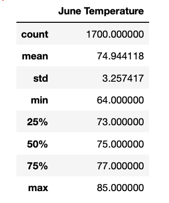
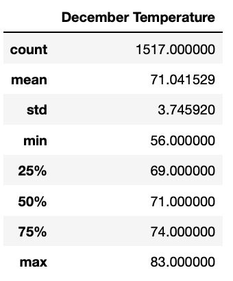
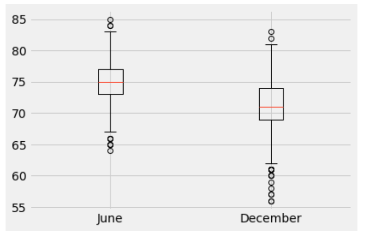

# surfs_up
Module 9

## Project Overview
The purpose of this project is to identify weather trends in Oahu in the months of June and December in order to determine if the surf and ice cream shop business is sustainable year-round.

## Resources
Data Source: hawaii.sqlite

Software: Anaconda Navigator 2.1.1, Jupyter Notebook 6.4.6, sqlite

## Results
### Deliverable 1 & 2
| D1: Determine the Summary Statistics for June | D2: Determine the Summary Statistics for December |
| --- | --- |
|  |  | 

### Deliverable 3: Statistical analysis 
- There are less data for December than for June, but since the counts are relatively high for both, it should not have too much impact on the analysis results.
- The average temperatures were very similar, being 74.9°F for June and 71.0°F in December. It can be seen that the average temperature is lower in December, but only by about 4°F.
- 25% of all data is below 69°F in December and 73°F in June. December has cooler days compared to June, where the minimum temperature was 56°F, while the lowest temperature in June was 64°F, a gap of 8°F.

From the temperature report we can see that there is not much difference in the temperature in June and December and we use a boxplot to obtain information about outliers and other trends. The results indicate that Oahu is an attractive destination to start a surf shop because temperature does not seem to be very volatile. 

Additionally, it would be useful to compare data on precipitation for June and December to evaluate how the weather changes during the year in addition to temperature changes.

